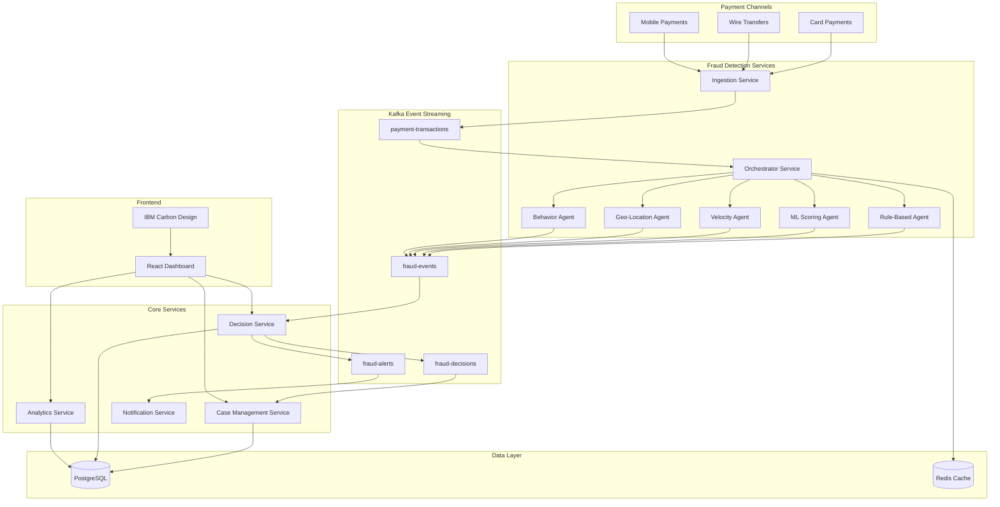

# Fraud Investigation Platform - Architecture Design

## System Overview
Enterprise-grade real-time fraud investigation platform for multi-channel banking payments (cards, transfers, mobile payments) processing ~5,000 transactions/second with ML-based scoring and analyst review.

## High-Level Architecture



## Technology Stack

### Backend
- **Language**: Java 17
- **Framework**: Spring Boot 3.x
- **Messaging**: Apache Kafka 3.x
- **Database**: PostgreSQL 15
- **Caching**: Redis (for velocity checks)
- **Build Tool**: Maven

### Frontend
- **Framework**: React 18
- **UI Library**: IBM Carbon Design System
- **State Management**: Redux Toolkit
- **API Client**: Axios
- **Build Tool**: Vite

## Module Structure

```
fraud-investigation-platform/
├── backend/
│   ├── fraud-ingestion-service/          # Entry point for all transactions
│   ├── fraud-orchestrator-service/       # Coordinates fraud agents
│   ├── fraud-agents/                     # Fraud detection agents
│   │   ├── rule-based-agent/
│   │   ├── ml-scoring-agent/
│   │   ├── velocity-agent/
│   │   ├── geo-location-agent/
│   │   └── behavior-agent/
│   ├── fraud-decision-service/           # Makes final fraud decisions
│   ├── case-management-service/          # Manages fraud cases
│   ├── analytics-service/                # Reporting and analytics
│   ├── notification-service/             # Alerts and notifications
│   └── shared-libraries/                 # Common utilities
│       ├── fraud-common/
│       ├── kafka-common/
│       └── security-common/
├── frontend/
│   └── fraud-dashboard/                  # React dashboard
├── infrastructure/
│   ├── kafka-topics/                     # Topic configurations
│   └── database/                         # Schema and migrations
└── docs/
    ├── api/                              # API documentation
    └── architecture/                     # Architecture docs
```

## Kafka Topic Design

### Topics
1. **payment-transactions** (Input)
   - Partitions: 20 (for parallel processing)
   - Retention: 7 days
   - Key: transaction_id
   - Value: Transaction payload

2. **fraud-events** (Processing)
   - Partitions: 20
   - Retention: 7 days
   - Key: transaction_id
   - Value: Fraud detection results from agents

3. **fraud-alerts** (Output)
   - Partitions: 10
   - Retention: 30 days
   - Key: transaction_id
   - Value: High-risk fraud alerts

4. **fraud-decisions** (Output)
   - Partitions: 10
   - Retention: 90 days
   - Key: transaction_id
   - Value: Final fraud decision with explanation

### Event Flow
```
Transaction → payment-transactions → Orchestrator → Fraud Agents → fraud-events → 
Decision Service → fraud-alerts/fraud-decisions → Case Management/Notification
```

## Database Schema Design

### Core Tables

#### transactions
```sql
CREATE TABLE transactions (
    transaction_id VARCHAR(50) PRIMARY KEY,
    channel VARCHAR(20) NOT NULL,  -- CARD, WIRE_TRANSFER, MOBILE
    amount DECIMAL(15,2) NOT NULL,
    currency VARCHAR(3) NOT NULL,
    customer_id VARCHAR(50) NOT NULL,
    merchant_id VARCHAR(50),
    timestamp TIMESTAMP NOT NULL,
    status VARCHAR(20) NOT NULL,
    metadata JSONB,
    created_at TIMESTAMP DEFAULT CURRENT_TIMESTAMP,
    INDEX idx_customer_timestamp (customer_id, timestamp),
    INDEX idx_channel_timestamp (channel, timestamp)
);
```

#### fraud_scores
```sql
CREATE TABLE fraud_scores (
    id BIGSERIAL PRIMARY KEY,
    transaction_id VARCHAR(50) NOT NULL,
    agent_name VARCHAR(50) NOT NULL,
    score DECIMAL(5,2) NOT NULL,  -- 0-100
    risk_level VARCHAR(20) NOT NULL,  -- LOW, MEDIUM, HIGH, CRITICAL
    confidence DECIMAL(5,2),
    features JSONB,  -- Features used for scoring
    explanation TEXT,  -- Explainable AI output
    processing_time_ms INTEGER,
    created_at TIMESTAMP DEFAULT CURRENT_TIMESTAMP,
    FOREIGN KEY (transaction_id) REFERENCES transactions(transaction_id),
    INDEX idx_transaction_agent (transaction_id, agent_name)
);
```

#### fraud_decisions
```sql
CREATE TABLE fraud_decisions (
    id BIGSERIAL PRIMARY KEY,
    transaction_id VARCHAR(50) NOT NULL,
    final_score DECIMAL(5,2) NOT NULL,
    decision VARCHAR(20) NOT NULL,  -- APPROVE, REVIEW, BLOCK
    decision_reason TEXT,
    contributing_factors JSONB,  -- Aggregated from all agents
    auto_decision BOOLEAN DEFAULT false,
    reviewed_by VARCHAR(50),
    reviewed_at TIMESTAMP,
    created_at TIMESTAMP DEFAULT CURRENT_TIMESTAMP,
    FOREIGN KEY (transaction_id) REFERENCES transactions(transaction_id),
    INDEX idx_decision_created (decision, created_at)
);
```

#### fraud_cases
```sql
CREATE TABLE fraud_cases (
    case_id VARCHAR(50) PRIMARY KEY,
    transaction_id VARCHAR(50) NOT NULL,
    status VARCHAR(20) NOT NULL,  -- OPEN, IN_PROGRESS, RESOLVED, CLOSED
    priority VARCHAR(20) NOT NULL,  -- LOW, MEDIUM, HIGH, CRITICAL
    assigned_to VARCHAR(50),
    resolution VARCHAR(20),  -- CONFIRMED_FRAUD, FALSE_POSITIVE, PENDING
    notes TEXT,
    created_at TIMESTAMP DEFAULT CURRENT_TIMESTAMP,
    updated_at TIMESTAMP DEFAULT CURRENT_TIMESTAMP,
    closed_at TIMESTAMP,
    FOREIGN KEY (transaction_id) REFERENCES transactions(transaction_id),
    INDEX idx_status_priority (status, priority),
    INDEX idx_assigned (assigned_to, status)
);
```

#### customer_profiles
```sql
CREATE TABLE customer_profiles (
    customer_id VARCHAR(50) PRIMARY KEY,
    risk_score DECIMAL(5,2),
    transaction_count INTEGER DEFAULT 0,
    fraud_count INTEGER DEFAULT 0,
    last_transaction_at TIMESTAMP,
    behavioral_patterns JSONB,
    created_at TIMESTAMP DEFAULT CURRENT_TIMESTAMP,
    updated_at TIMESTAMP DEFAULT CURRENT_TIMESTAMP
);
```

#### audit_log
```sql
CREATE TABLE audit_log (
    id BIGSERIAL PRIMARY KEY,
    entity_type VARCHAR(50) NOT NULL,
    entity_id VARCHAR(50) NOT NULL,
    action VARCHAR(50) NOT NULL,
    user_id VARCHAR(50),
    changes JSONB,
    timestamp TIMESTAMP DEFAULT CURRENT_TIMESTAMP,
    INDEX idx_entity (entity_type, entity_id),
    INDEX idx_timestamp (timestamp)
);
```

## Fraud Detection Agents (Java Service Classes)

### 1. Rule-Based Agent
**Purpose**: Apply predefined business rules
**Rules**:
- Transaction amount thresholds
- Blacklisted merchants/countries
- Time-based restrictions
- Duplicate transaction detection

### 2. ML Scoring Agent
**Purpose**: Machine learning-based fraud prediction
**Features**:
- Transaction amount patterns
- Customer behavior history
- Merchant risk profile
- Time and location patterns
**Model**: Gradient Boosting (XGBoost/LightGBM)
**Output**: Fraud probability score (0-100)

### 3. Velocity Agent
**Purpose**: Detect unusual transaction velocity
**Checks**:
- Transactions per hour/day
- Amount velocity
- Geographic velocity
- Channel switching patterns

### 4. Geo-Location Agent
**Purpose**: Analyze geographic patterns
**Checks**:
- Impossible travel detection
- High-risk country transactions
- Location consistency
- IP vs billing address mismatch

### 5. Behavior Agent
**Purpose**: Analyze customer behavior patterns
**Checks**:
- Deviation from normal spending
- Unusual merchant categories
- Time-of-day anomalies
- Device fingerprint changes

## Explainable AI Implementation

### SHAP (SHapley Additive exPlanations)
```java
public class ExplainableAIService {
    public FraudExplanation explainDecision(
        Transaction transaction,
        List<FraudScore> agentScores
    ) {
        // Aggregate feature importance from all agents
        Map<String, Double> featureImportance = calculateFeatureImportance(agentScores);
        
        // Generate human-readable explanation
        String explanation = generateExplanation(featureImportance, agentScores);
        
        // Identify top contributing factors
        List<ContributingFactor> topFactors = identifyTopFactors(featureImportance);
        
        return new FraudExplanation(explanation, topFactors, featureImportance);
    }
}
```

### Explanation Output Format
```json
{
  "transaction_id": "TXN123456",
  "final_score": 87.5,
  "decision": "REVIEW",
  "explanation": "High fraud risk detected due to unusual transaction patterns",
  "contributing_factors": [
    {
      "factor": "Transaction amount significantly higher than customer average",
      "impact": 35.2,
      "agent": "ML_SCORING_AGENT"
    },
    {
      "factor": "Transaction from new geographic location",
      "impact": 28.7,
      "agent": "GEO_LOCATION_AGENT"
    },
    {
      "factor": "Multiple transactions in short time window",
      "impact": 23.6,
      "agent": "VELOCITY_AGENT"
    }
  ],
  "feature_importance": {
    "amount_deviation": 0.352,
    "location_change": 0.287,
    "transaction_velocity": 0.236,
    "merchant_risk": 0.125
  }
}
```

## API Design

### REST APIs

#### Transaction Ingestion
```
POST /api/v1/transactions
Content-Type: application/json

{
  "transaction_id": "TXN123456",
  "channel": "CARD",
  "amount": 1500.00,
  "currency": "USD",
  "customer_id": "CUST789",
  "merchant_id": "MERCH456",
  "timestamp": "2024-01-15T10:30:00Z",
  "metadata": {
    "card_last4": "1234",
    "ip_address": "192.168.1.1",
    "device_id": "DEV123"
  }
}
```

#### Case Management
```
GET /api/v1/cases?status=OPEN&priority=HIGH
GET /api/v1/cases/{case_id}
PUT /api/v1/cases/{case_id}/assign
PUT /api/v1/cases/{case_id}/resolve
POST /api/v1/cases/{case_id}/notes
```

#### Analytics
```
GET /api/v1/analytics/fraud-trends?period=7d
GET /api/v1/analytics/agent-performance
GET /api/v1/analytics/false-positive-rate
```

### WebSocket for Real-Time Updates
```
ws://localhost:8080/ws/fraud-alerts
ws://localhost:8080/ws/case-updates
```

## React Dashboard Design

### Key Components

#### 1. Dashboard Overview
- Real-time fraud metrics
- Alert queue
- Case statistics
- Agent performance

#### 2. Transaction Monitor
- Live transaction feed
- Fraud score visualization
- Quick actions (approve/block/review)

#### 3. Case Management
- Case list with filters
- Case details with timeline
- Investigation workflow
- Notes and collaboration

#### 4. Analytics & Reporting
- Fraud trends charts
- Agent performance metrics
- False positive analysis
- Custom reports

#### 5. Configuration
- Rule management
- Threshold configuration
- Agent settings
- User management

### IBM Carbon Components
- DataTable for transaction/case lists
- Modal for case details
- Notification for alerts
- Charts (LineChart, DonutChart) for analytics
- Tabs for navigation
- Form components for configuration

## Performance Considerations

### Throughput Target: 5,000 TPS
- Kafka partitioning: 20 partitions for parallel processing
- Horizontal scaling: Multiple instances of each service
- Redis caching: Customer profiles and velocity data
- Database connection pooling: HikariCP
- Async processing: CompletableFuture for agent coordination

### Latency Target: < 100ms per transaction
- Optimized database queries with proper indexing
- Cached customer profiles
- Parallel agent execution
- Efficient Kafka consumer configuration

## Security Considerations

### Authentication & Authorization
- JWT-based authentication
- Role-based access control (RBAC)
- API key for service-to-service communication

### Data Protection
- Encryption at rest (PostgreSQL)
- Encryption in transit (TLS)
- PII data masking in logs
- Audit logging for all actions

### Compliance
- GDPR compliance for customer data
- PCI DSS for payment data
- SOC 2 audit trail

## Testing Strategy

### Unit Tests
- JUnit 5 for Java services
- Jest for React components
- Mockito for mocking dependencies

### Integration Tests
- TestContainers for Kafka and PostgreSQL
- Spring Boot Test for service integration
- React Testing Library for UI

### Performance Tests
- JMeter for load testing
- Kafka performance testing
- Database query optimization

### End-to-End Tests
- Selenium for UI automation
- Postman/Newman for API testing

## Deployment Considerations

### Local Development
- Docker Compose for Kafka, PostgreSQL, Redis
- Spring Boot DevTools for hot reload
- Vite HMR for React development

### Monitoring & Observability
- Prometheus for metrics
- Grafana for dashboards
- ELK stack for log aggregation
- Distributed tracing with Jaeger

## Next Steps

1. Set up project structure and build configuration
2. Implement Kafka infrastructure and topics
3. Create database schema and migrations
4. Develop fraud detection agents
5. Build orchestrator service
6. Implement decision service with explainable AI
7. Create case management service
8. Develop React dashboard
9. Integration testing
10. Performance optimization