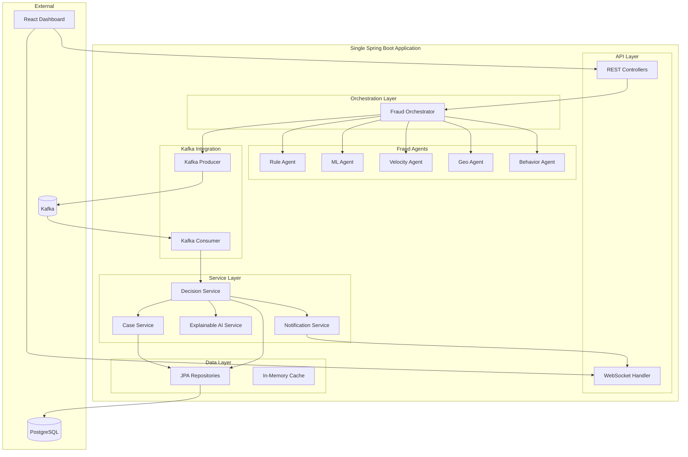

# Fraud Investigation Platform - Hackathon Modular Monolith

## Overview
Simplified, demo-ready fraud investigation platform as a **single Spring Boot application** with modular package structure. Optimized for hackathon development with focus on high-impact features.

## Architecture Philosophy
- **Modular Monolith**: Single deployable unit with clear module boundaries
- **Event-Driven**: Kafka for async processing within the monolith
- **Demo-Ready**: Focus on visual impact and core fraud detection
- **Simplified**: No microservices, no K8s, no complex infrastructure

## High-Level Architecture



## Package Structure

```
fraud-investigation-platform/
├── src/
│   ├── main/
│   │   ├── java/
│   │   │   └── com/
│   │   │       └── fraud/
│   │   │           └── platform/
│   │   │               ├── FraudPlatformApplication.java
│   │   │               │
│   │   │               ├── controller/              # REST & WebSocket
│   │   │               │   ├── TransactionController.java
│   │   │               │   ├── CaseController.java
│   │   │               │   ├── DashboardController.java
│   │   │               │   └── WebSocketController.java
│   │   │               │
│   │   │               ├── orchestrator/            # Fraud orchestration
│   │   │               │   ├── FraudOrchestrator.java
│   │   │               │   └── AgentCoordinator.java
│   │   │               │
│   │   │               ├── agents/                  # Fraud detection agents
│   │   │               │   ├── FraudAgent.java (interface)
│   │   │               │   ├── RuleBasedAgent.java
│   │   │               │   ├── MLScoringAgent.java
│   │   │               │   ├── VelocityAgent.java
│   │   │               │   ├── GeoLocationAgent.java
│   │   │               │   └── BehaviorAgent.java
│   │   │               │
│   │   │               ├── service/                 # Business logic
│   │   │               │   ├── DecisionService.java
│   │   │               │   ├── CaseService.java
│   │   │               │   ├── ExplainableAIService.java
│   │   │               │   ├── NotificationService.java
│   │   │               │   └── AnalyticsService.java
│   │   │               │
│   │   │               ├── kafka/                   # Kafka integration
│   │   │               │   ├── KafkaProducerService.java
│   │   │               │   ├── KafkaConsumerService.java
│   │   │               │   ├── TopicConfig.java
│   │   │               │   └── events/
│   │   │               │       ├── TransactionEvent.java
│   │   │               │       ├── FraudScoreEvent.java
│   │   │               │       └── FraudDecisionEvent.java
│   │   │               │
│   │   │               ├── repository/              # Data access
│   │   │               │   ├── TransactionRepository.java
│   │   │               │   ├── FraudScoreRepository.java
│   │   │               │   ├── FraudDecisionRepository.java
│   │   │               │   ├── CaseRepository.java
│   │   │               │   └── CustomerProfileRepository.java
│   │   │               │
│   │   │               ├── entity/                  # JPA entities
│   │   │               │   ├── Transaction.java
│   │   │               │   ├── FraudScore.java
│   │   │               │   ├── FraudDecision.java
│   │   │               │   ├── FraudCase.java
│   │   │               │   └── CustomerProfile.java
│   │   │               │
│   │   │               ├── model/                   # DTOs
│   │   │               │   ├── TransactionRequest.java
│   │   │               │   ├── FraudResponse.java
│   │   │               │   ├── CaseDTO.java
│   │   │               │   └── DashboardMetrics.java
│   │   │               │
│   │   │               ├── config/                  # Configuration
│   │   │               │   ├── KafkaConfig.java
│   │   │               │   ├── WebSocketConfig.java
│   │   │               │   ├── CacheConfig.java
│   │   │               │   └── SecurityConfig.java
│   │   │               │
│   │   │               └── util/                    # Utilities
│   │   │                   ├── FraudScoreCalculator.java
│   │   │                   └── ExplanationGenerator.java
│   │   │
│   │   └── resources/
│   │       ├── application.yml
│   │       ├── application-dev.yml
│   │       └── db/
│   │           └── migration/
│   │               ├── V1__create_tables.sql
│   │               └── V2__add_indexes.sql
│   │
│   └── test/
│       └── java/
│           └── com/
│               └── fraud/
│                   └── platform/
│                       ├── agents/
│                       ├── service/
│                       └── integration/
│
├── frontend/                                        # React Dashboard
│   ├── src/
│   │   ├── components/
│   │   │   ├── Dashboard/
│   │   │   ├── TransactionMonitor/
│   │   │   ├── CaseManagement/
│   │   │   └── Analytics/
│   │   ├── services/
│   │   │   ├── api.js
│   │   │   └── websocket.js
│   │   ├── store/
│   │   └── App.jsx
│   ├── package.json
│   └── vite.config.js
│
├── docker-compose-dev.yml                           # Local Kafka + PostgreSQL
├── pom.xml
└── README.md
```

## Simplified Database Schema

### Core Tables (MVP)

```sql
-- Transactions
CREATE TABLE transactions (
    id BIGSERIAL PRIMARY KEY,
    transaction_id VARCHAR(50) UNIQUE NOT NULL,
    channel VARCHAR(20) NOT NULL,
    amount DECIMAL(15,2) NOT NULL,
    currency VARCHAR(3) NOT NULL,
    customer_id VARCHAR(50) NOT NULL,
    merchant_id VARCHAR(50),
    timestamp TIMESTAMP NOT NULL,
    status VARCHAR(20) NOT NULL,
    metadata JSONB,
    created_at TIMESTAMP DEFAULT CURRENT_TIMESTAMP
);
CREATE INDEX idx_transactions_customer ON transactions(customer_id, timestamp);
CREATE INDEX idx_transactions_status ON transactions(status);

-- Fraud Scores
CREATE TABLE fraud_scores (
    id BIGSERIAL PRIMARY KEY,
    transaction_id VARCHAR(50) NOT NULL,
    agent_name VARCHAR(50) NOT NULL,
    score DECIMAL(5,2) NOT NULL,
    risk_level VARCHAR(20) NOT NULL,
    explanation TEXT,
    created_at TIMESTAMP DEFAULT CURRENT_TIMESTAMP,
    FOREIGN KEY (transaction_id) REFERENCES transactions(transaction_id)
);
CREATE INDEX idx_fraud_scores_transaction ON fraud_scores(transaction_id);

-- Fraud Decisions
CREATE TABLE fraud_decisions (
    id BIGSERIAL PRIMARY KEY,
    transaction_id VARCHAR(50) NOT NULL,
    final_score DECIMAL(5,2) NOT NULL,
    decision VARCHAR(20) NOT NULL,
    explanation JSONB,
    created_at TIMESTAMP DEFAULT CURRENT_TIMESTAMP,
    FOREIGN KEY (transaction_id) REFERENCES transactions(transaction_id)
);
CREATE INDEX idx_fraud_decisions_decision ON fraud_decisions(decision, created_at);

-- Fraud Cases
CREATE TABLE fraud_cases (
    id BIGSERIAL PRIMARY KEY,
    case_id VARCHAR(50) UNIQUE NOT NULL,
    transaction_id VARCHAR(50) NOT NULL,
    status VARCHAR(20) NOT NULL,
    priority VARCHAR(20) NOT NULL,
    assigned_to VARCHAR(50),
    resolution VARCHAR(20),
    notes TEXT,
    created_at TIMESTAMP DEFAULT CURRENT_TIMESTAMP,
    updated_at TIMESTAMP DEFAULT CURRENT_TIMESTAMP,
    FOREIGN KEY (transaction_id) REFERENCES transactions(transaction_id)
);
CREATE INDEX idx_fraud_cases_status ON fraud_cases(status, priority);

-- Customer Profiles (simplified)
CREATE TABLE customer_profiles (
    customer_id VARCHAR(50) PRIMARY KEY,
    risk_score DECIMAL(5,2),
    transaction_count INTEGER DEFAULT 0,
    last_transaction_at TIMESTAMP,
    behavioral_data JSONB,
    created_at TIMESTAMP DEFAULT CURRENT_TIMESTAMP
);
```

## Kafka Topics (Simplified)

```yaml
Topics:
  1. fraud-transactions (Input)
     - Partitions: 3
     - Purpose: Incoming transactions for fraud check
     
  2. fraud-results (Output)
     - Partitions: 3
     - Purpose: Fraud detection results
     
  3. fraud-alerts (Notifications)
     - Partitions: 1
     - Purpose: High-risk alerts for dashboard
```

## MVP Feature List

### Phase 1: Core Fraud Detection (Day 1-2)
1. ✓ Transaction ingestion API
2. ✓ Kafka producer/consumer setup
3. ✓ Rule-based fraud agent
4. ✓ ML scoring agent (simple model)
5. ✓ Fraud orchestrator
6. ✓ Decision service
7. ✓ Basic database persistence

### Phase 2: Explainable AI (Day 2-3)
1. ✓ Feature importance calculation
2. ✓ Explanation generation
3. ✓ Contributing factors identification
4. ✓ Human-readable explanations

### Phase 3: Dashboard (Day 3-4)
1. ✓ Real-time transaction feed
2. ✓ Fraud score visualization
3. ✓ Case management UI
4. ✓ Dashboard metrics
5. ✓ WebSocket for live updates

### Phase 4: Demo Polish (Day 4-5)
1. ✓ Sample data generator
2. ✓ Demo scenarios
3. ✓ Visual enhancements
4. ✓ Performance optimization

## High-Impact Demo Features

### 1. Real-Time Fraud Detection
- Live transaction feed with instant fraud scoring
- Color-coded risk levels (green/yellow/red)
- Animated score updates

### 2. Explainable AI Visualization
- Interactive explanation cards
- Feature importance bar charts
- Contributing factors breakdown
- "Why was this flagged?" section

### 3. Interactive Case Management
- Drag-and-drop case assignment
- One-click approve/block actions
- Case timeline visualization
- Quick notes and resolution

### 4. Live Dashboard Metrics
- Real-time fraud rate gauge
- Transaction volume chart
- Agent performance metrics
- Alert queue counter

### 5. Demo Mode
- Auto-generate realistic transactions
- Simulate fraud patterns
- Adjustable fraud rate
- Scenario playback

## Technology Stack (Simplified)

### Backend
- **Java 17**
- **Spring Boot 3.2** (single application)
- **Spring Data JPA** (database access)
- **Spring Kafka** (event streaming)
- **PostgreSQL** (persistence)
- **Caffeine** (in-memory caching)
- **Flyway** (database migrations)

### Frontend
- **React 18**
- **IBM Carbon Design System**
- **Redux Toolkit** (state management)
- **Recharts** (charts)
- **WebSocket** (real-time updates)
- **Vite** (build tool)

### Development
- **Docker Compose** (Kafka + PostgreSQL)
- **H2** (optional in-memory DB for testing)
- **JUnit 5** (testing)

## Recommended Kafka Setup (Docker Compose)

```yaml
version: '3.8'
services:
  zookeeper:
    image: confluentinc/cp-zookeeper:7.5.0
    environment:
      ZOOKEEPER_CLIENT_PORT: 2181
    ports:
      - "2181:2181"

  kafka:
    image: confluentinc/cp-kafka:7.5.0
    depends_on:
      - zookeeper
    ports:
      - "9092:9092"
    environment:
      KAFKA_BROKER_ID: 1
      KAFKA_ZOOKEEPER_CONNECT: zookeeper:2181
      KAFKA_ADVERTISED_LISTENERS: PLAINTEXT://localhost:9092
      KAFKA_OFFSETS_TOPIC_REPLICATION_FACTOR: 1

  postgres:
    image: postgres:15
    environment:
      POSTGRES_DB: frauddb
      POSTGRES_USER: fraud
      POSTGRES_PASSWORD: fraud123
    ports:
      - "5432:5432"
    volumes:
      - postgres_data:/var/lib/postgresql/data

volumes:
  postgres_data:
```

## Implementation Order (5-Day Hackathon)

### Day 1: Foundation
1. **Morning**: Project setup, Spring Boot app, database schema
2. **Afternoon**: Kafka integration, basic REST API, transaction ingestion

### Day 2: Fraud Detection
1. **Morning**: Fraud orchestrator, rule-based agent, ML agent
2. **Afternoon**: Decision service, explainable AI service, database persistence

### Day 3: Additional Agents & Dashboard Setup
1. **Morning**: Velocity agent, geo-location agent, behavior agent
2. **Afternoon**: React project setup, API integration, basic layout

### Day 4: Dashboard Features
1. **Morning**: Transaction monitor, real-time feed, WebSocket
2. **Afternoon**: Case management UI, fraud score visualization

### Day 5: Demo Polish
1. **Morning**: Dashboard metrics, analytics, demo data generator
2. **Afternoon**: Visual polish, demo scenarios, presentation prep

## Key Simplifications from Original Design

### Removed
- ❌ Separate microservices (now single monolith)
- ❌ Service mesh / API gateway
- ❌ Distributed tracing
- ❌ Prometheus + Grafana
- ❌ ELK stack
- ❌ Redis (using Caffeine cache)
- ❌ Complex deployment pipeline
- ❌ Kubernetes manifests

### Kept
- ✅ Kafka event streaming
- ✅ Fraud orchestration pattern
- ✅ Multiple fraud agents
- ✅ Explainable AI
- ✅ React dashboard with IBM Carbon
- ✅ PostgreSQL database
- ✅ Real-time WebSocket updates

## API Endpoints (Simplified)

### Transaction API
```
POST   /api/transactions              # Submit transaction
GET    /api/transactions/{id}         # Get transaction details
GET    /api/transactions              # List transactions
```

### Case API
```
GET    /api/cases                     # List cases
GET    /api/cases/{id}                # Get case details
PUT    /api/cases/{id}/assign         # Assign case
PUT    /api/cases/{id}/resolve        # Resolve case
POST   /api/cases/{id}/notes          # Add note
```

### Dashboard API
```
GET    /api/dashboard/metrics         # Real-time metrics
GET    /api/dashboard/alerts          # Recent alerts
GET    /api/dashboard/trends          # Fraud trends
```

### WebSocket
```
ws://localhost:8080/ws/fraud-alerts   # Real-time alerts
```

## Demo Scenarios

### Scenario 1: High-Value Transaction
- Large amount ($10,000)
- New merchant
- Unusual time (3 AM)
- **Expected**: High fraud score, auto-review

### Scenario 2: Velocity Attack
- 5 transactions in 2 minutes
- Different merchants
- Same customer
- **Expected**: Velocity agent flags, medium-high score

### Scenario 3: Geographic Anomaly
- Transaction in New York
- 30 minutes later: Transaction in London
- **Expected**: Geo agent flags impossible travel

### Scenario 4: Behavior Change
- Customer usually spends $50-100
- Sudden $5,000 transaction
- Different merchant category
- **Expected**: Behavior agent flags deviation

### Scenario 5: Clean Transaction
- Normal amount
- Known merchant
- Typical time
- Consistent location
- **Expected**: Low fraud score, auto-approve

## Performance Targets (Hackathon)

- **Throughput**: 100 TPS (reduced from 5,000)
- **Latency**: < 500ms per transaction (relaxed from 100ms)
- **Database**: Single PostgreSQL instance
- **Kafka**: Single broker (development mode)
- **Caching**: In-memory (Caffeine)

## Success Criteria

### Functional
- ✓ All 5 fraud agents working
- ✓ Explainable AI generating clear explanations
- ✓ Real-time dashboard updates
- ✓ Case management workflow
- ✓ Demo scenarios working

### Demo Impact
- ✓ Visually impressive dashboard
- ✓ Live fraud detection demonstration
- ✓ Clear explanation of AI decisions
- ✓ Interactive case management
- ✓ Smooth demo flow

### Technical
- ✓ Single command startup (docker-compose + mvn spring-boot:run)
- ✓ No complex deployment
- ✓ Stable and reliable
- ✓ Good code organization

## Next Steps

1. Review and approve this simplified architecture
2. Set up Spring Boot project with package structure
3. Configure Docker Compose for Kafka + PostgreSQL
4. Begin Day 1 implementation
5. Focus on demo-ready features

## Notes

- **Modular Monolith**: Clear package boundaries, easy to split later if needed
- **Hackathon-Optimized**: Focus on working demo over production-ready code
- **Visual Impact**: Dashboard and explainable AI are key differentiators
- **Simplified Infrastructure**: Docker Compose only, no K8s complexity
- **Demo-First**: Every feature should contribute to the demo narrative