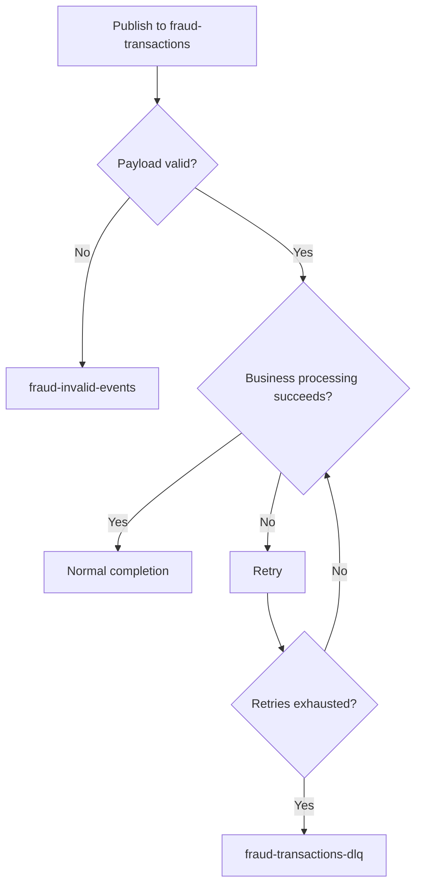

# Kafka DLQ Testing Guide

This document explains how to validate that Kafka DLQ support is working and how to confirm records are being routed to the correct topic.

## Scope

This guide validates the DLQ behavior implemented for:
- valid business events that fail repeatedly during processing
- invalid or malformed events that must not enter the business DLQ

Relevant implementation files:
- [`src/main/java/com/fraud/platform/config/KafkaConfig.java`](src/main/java/com/fraud/platform/config/KafkaConfig.java)
- [`src/main/java/com/fraud/platform/kafka/KafkaConsumerService.java`](src/main/java/com/fraud/platform/kafka/KafkaConsumerService.java)
- [`src/main/resources/application.yml`](src/main/resources/application.yml)

## Topic Behavior

Expected topic routing:

- `fraud-transactions` = primary input topic
- `fraud-transactions-dlq` = valid payloads that fail after retry exhaustion
- `fraud-invalid-events` = malformed, unparseable, or invalid payloads

## Validation Flow



## Prerequisites

Before testing, make sure:
- Kafka is running
- the Spring Boot application is running
- the required topics are created
- the project compiles successfully

Configured topics are defined in [`src/main/resources/application.yml`](src/main/resources/application.yml).

## Step 1: Verify Topics Exist

Confirm these topics are available in Kafka:
- `fraud-transactions`
- `fraud-transactions-dlq`
- `fraud-invalid-events`

If you are using Kafka CLI, list topics from the broker environment.

Example:
```bash
kafka-topics --bootstrap-server localhost:9092 --list
```

## Step 2: Validate Business Failure to DLQ

This validates that a valid [`TransactionEvent`](src/main/java/com/fraud/platform/kafka/events/TransactionEvent.java) retries and eventually lands in the business DLQ.

### Method

Send a syntactically valid event to `fraud-transactions`, but force processing to fail consistently inside:
- [`KafkaConsumerService.consumeTransactionEvent()`](src/main/java/com/fraud/platform/kafka/KafkaConsumerService.java:37)
- or downstream inside [`FraudOrchestratorService.analyzeTransaction()`](src/main/java/com/fraud/platform/orchestrator/FraudOrchestratorService.java:56)

### Fastest Test Option

Temporarily add a forced exception after validation in [`KafkaConsumerService.consumeTransactionEvent()`](src/main/java/com/fraud/platform/kafka/KafkaConsumerService.java:37).

Example approach:
```java
throw new RuntimeException("DLQ test");
```

Place it after [`validateEvent()`](src/main/java/com/fraud/platform/kafka/KafkaConsumerService.java:59) and before orchestration.

Remove this forced exception after testing.

### Valid Payload Example

```json
{
  "txnId": "DLQ-TEST-001",
  "customerId": "CUST-1001",
  "amount": 12500,
  "merchant": "TEST_STORE",
  "country": "IN",
  "deviceId": "DEV-1",
  "paymentType": "CARD",
  "timestamp": "2026-05-13T10:00:00"
}
```

### Expected Result

- consumer retries according to settings in [`src/main/resources/application.yml`](src/main/resources/application.yml)
- after retries are exhausted, the record is published to `fraud-transactions-dlq`

## Step 3: Validate Invalid Payload Routing

This validates that malformed or invalid input does not enter the business DLQ.

### Invalid Event Cases

These should go to `fraud-invalid-events`:
- invalid JSON
- deserialization errors
- schema mismatch
- missing mandatory fields

Validation rules are enforced in [`KafkaConsumerService.validateEvent()`](src/main/java/com/fraud/platform/kafka/KafkaConsumerService.java:59).

### Example Missing Fields Payload

```json
{
  "txnId": "",
  "amount": 12500,
  "timestamp": "2026-05-13T10:00:00"
}
```

### Expected Result

- no business retry flow should be used for invalid payloads
- the event should be routed to `fraud-invalid-events`

## Step 4: Consume from DLQ Topics

Use a Kafka consumer to read the routed records.

### Consume Business DLQ

```bash
kafka-console-consumer --bootstrap-server localhost:9092 --topic fraud-transactions-dlq --from-beginning
```

### Consume Invalid Events

```bash
kafka-console-consumer --bootstrap-server localhost:9092 --topic fraud-invalid-events --from-beginning
```

If your tooling supports headers, consume with headers enabled to inspect Spring Kafka exception metadata.

## Step 5: Check Application Logs

Review logs from:
- [`KafkaConfig.kafkaErrorHandler()`](src/main/java/com/fraud/platform/config/KafkaConfig.java:135)
- [`KafkaConsumerService.consumeTransactionEvent()`](src/main/java/com/fraud/platform/kafka/KafkaConsumerService.java:37)

Look for:
- repeated failures for the same `txnId`
- retries being attempted
- final dead-letter publication
- invalid payload exceptions such as [`IllegalArgumentException`](src/main/java/com/fraud/platform/kafka/KafkaConsumerService.java:61)

## Validation Matrix

| Scenario | Input | Expected Topic |
|---|---|---|
| business exception | valid JSON plus forced runtime failure | `fraud-transactions-dlq` |
| invalid schema | valid JSON missing `txnId` or `customerId` | `fraud-invalid-events` |
| malformed JSON | broken JSON | `fraud-invalid-events` |
| happy path | valid JSON with no exception | no DLQ topic |

## Strong Proof That DLQ Is Working

DLQ implementation is considered validated when one or more of these are observed:

- the message is readable from `fraud-transactions-dlq`
- Kafka UI shows the record in `fraud-transactions-dlq`
- topic offsets increase for the DLQ topic
- application logs show retries followed by dead-letter publication

Invalid event routing is considered validated when:
- malformed or missing-field events are readable from `fraud-invalid-events`

## Recommended End-to-End Test Sequence

1. Start Kafka
2. Start the Spring Boot application
3. Confirm the topics exist
4. Force a runtime exception for a valid event
5. Publish one valid event to `fraud-transactions`
6. Consume from `fraud-transactions-dlq`
7. Publish one malformed or invalid event
8. Consume from `fraud-invalid-events`
9. Remove the temporary forced exception

## Future Improvement

A stronger long-term validation approach is to add an automated integration test using:
- [`spring-kafka-test`](pom.xml:108)
- embedded Kafka or Testcontainers

This would validate:
- retry behavior
- business DLQ routing
- invalid event routing
- record presence in the expected Kafka topics